# MaxText TPU Training Demo

A complete end-to-end demonstration of fine-tuning Gemma-2-2B on TPU v6e using MaxText and serving with vLLM on Google Kubernetes Engine (GKE).

## Project Overview

This demo showcases a complete ML pipeline:
- **TPU v6e Training** on Google Kubernetes Engine
- **Gemma-2-2B Fine-tuning** using MaxText in JAX
- **Model Format Conversion** between HuggingFace and MaxText
- **Inference Testing** on TPU with parameter-only checkpoints
- **Model Serving** with vLLM on GPU for production
- **Infrastructure as Code** using Terraform

## Pipeline Architecture

```mermaid
graph TB
    subgraph "Google Cloud Platform"
        subgraph "Storage"
            GCS[("GCS Buckets<br/>• Artifacts<br/>• Datasets")]
            AR[("Artifact Registry<br/>Docker Images")]
        end
        
        subgraph "GKE Cluster"
            subgraph "TPU Node Pool (v6e-8)"
                S1[Step 1: Convert<br/>HF → MaxText]
                S2[Step 2: Fine-tuning<br/>UltraChat 200K]
                S3[Step 3: Inference Test<br/>Parameter-only]
                S4[Step 4: Convert<br/>MaxText → HF]
            end
            
            subgraph "GPU Node Pool"
                S5[Step 5: vLLM Serving<br/>Production API]
            end
        end
    end
    
    HF[("HuggingFace<br/>google/gemma-2-2b")] --> S1
    S1 --> GCS
    GCS --> S2
    S2 --> S3
    S3 --> S4
    S4 --> GCS
    GCS --> S5
    
    S5 --> API[("OpenAI API<br/>Compatible Endpoint")]
    
    classDef tpu fill:#e1f5fe,stroke:#01579b,stroke-width:2px
    classDef gpu fill:#f3e5f5,stroke:#4a148c,stroke-width:2px
    classDef storage fill:#e8f5e8,stroke:#1b5e20,stroke-width:2px
    
    class S1,S2,S3,S4 tpu
    class S5 gpu
    class GCS,AR,HF storage
```



## Fine-Tuning Process Deep Dive


## MaxText Checkpoint Types & Fine-Tuning Requirements

```mermaid
graph TB
    subgraph "HuggingFace Model"
        HF_MODEL[("Gemma-2-2B<br/>Standard PyTorch Format<br/>• model.safetensors<br/>• config.json<br/>• tokenizer files")]
    end
    
    subgraph "MaxText Checkpoint Formats"
        subgraph "Scanned Checkpoints"
            SCANNED[("Scanned Checkpoint<br/>scan_layers=true<br/>REQUIRED FOR TRAINING<br/>• Optimized layer structure<br/>• Efficient for gradient computation<br/>• Used as input for fine-tuning")]
        end
        
        subgraph "Training Outputs"
            FULL_STATE[("Full State Checkpoint<br/>Training Output<br/>• Model parameters<br/>• Optimizer state (AdamW)<br/>• Learning rate schedule<br/>• Step counters")]
        end
        
        subgraph "Inference Optimized"
            UNSCANNED[("Parameter-only Checkpoint<br/>force_unroll=true<br/>OPTIMIZED FOR INFERENCE<br/>• No optimizer state<br/>• Unrolled layers<br/>• Faster loading<br/>• Memory efficient")]
        end
    end
    
    subgraph "TPU v6e-8 Memory Layout"
        TPU_MEM[("31.25 GB HBM per chip<br/>× 8 chips = 250 GB total<br/>Gemma-2-2B: ~1.22 GB per chip<br/>Memory utilization: ~3.9%")]
    end
    
    HF_MODEL -->|"Step 1: Convert<br/>scan_layers=true"| SCANNED
    SCANNED -->|"Step 2: Fine-tune<br/>1000 steps"| FULL_STATE
    FULL_STATE -->|"Step 3: Extract params<br/>force_unroll=true"| UNSCANNED
    FULL_STATE -->|"Step 4: Convert back<br/>to HuggingFace"| HF_MODEL
    
    SCANNED -.->|"Required for"| TRAINING[("Fine-Tuning Process<br/>• Gradient computation<br/>• Backpropagation<br/>• Parameter updates")]
    UNSCANNED -.->|"Optimized for"| INFERENCE[("Inference Process<br/>• Fast loading<br/>• Memory efficient<br/>• No training overhead")]
    
    classDef hf fill:#ff9800,stroke:#e65100,stroke-width:2px,color:#fff
    classDef scanned fill:#4caf50,stroke:#2e7d32,stroke-width:3px,color:#fff
    classDef fullstate fill:#2196f3,stroke:#1565c0,stroke-width:2px,color:#fff
    classDef unscanned fill:#9c27b0,stroke:#6a1b9a,stroke-width:2px,color:#fff
    classDef memory fill:#607d8b,stroke:#37474f,stroke-width:2px,color:#fff
    classDef process fill:#ffc107,stroke:#f57f17,stroke-width:2px
    
    class HF_MODEL hf
    class SCANNED scanned
    class FULL_STATE fullstate
    class UNSCANNED unscanned
    class TPU_MEM memory
    class TRAINING,INFERENCE process
```



## Fine-Tuning Process Requirements

### Prerequisites for Fine-Tuning

- **Scanned Checkpoint**: `scan_layers=true` - Optimized layer structure required for training
- **TPU Hardware**: v6e-8 slice (2x4 topology) with 250 GB total HBM memory
- **Training Dataset**: UltraChat 200K dataset, tokenized and formatted for MaxText
- **MaxText Framework**: JAX-based distributed training framework

### Fine-Tuning Configuration

- **Training Steps**: 1000 steps for demonstration (adjustable)
- **Batch Size**: 8 per device (64 global batch size across 8 TPU chips)
- **Learning Rate**: Adaptive learning rate scheduling
- **Sequence Length**: `max_target_length=1024` tokens
- **Precision**: `weight_dtype=bfloat16` for memory efficiency

### Training Process Flow

1. **Initialize**: Load scanned checkpoint as starting point
2. **Forward Pass**: Compute model predictions on input batch
3. **Loss Calculation**: Calculate cross-entropy loss against targets
4. **Backward Pass**: Compute gradients via backpropagation
5. **Parameter Update**: Apply AdamW optimizer updates
6. **Checkpoint Saving**: Save full state (parameters + optimizer) periodically
7. **Repeat**: Continue training loop until completion

### Output Checkpoints

- **Full State Checkpoint**: Contains model parameters, optimizer state, and training metadata
- **Checkpoint Structure**: Saved in Orbax format with `/items` subdirectory
- **Usage**: Can be used for inference, further training, or conversion to other formats

## Directory Structure

```
maxtext-tpu-training-demo/
├── terraform/                           # Infrastructure as Code
│   ├── main.tf                         # Main Terraform configuration
│   ├── variables.tf                    # Input variables
│   ├── outputs.tf                      # Output values
│   └── terraform.tfvars.example        # Example variables file
├── kubernetes/                         # Kubernetes manifests
│   ├── step1-convert-hf-to-maxtext.yaml    # HF → MaxText conversion
│   ├── step2-fine-tuning.yaml              # Fine-tuning job
│   ├── step3-inference-test.yaml           # Inference testing
│   ├── step4-convert-maxtext-to-hf.yaml    # MaxText → HF conversion
│   └── step5-gpu-serving.yaml              # vLLM GPU serving
├── docker/                            # Docker configurations
│   ├── Dockerfile.maxtext-clean        # MaxText training image
│   └── Dockerfile.vllm                 # vLLM serving image
├── scripts/                           # Automation scripts
│   ├── deploy.sh                      # Main deployment script
│   ├── deploy-full-pipeline.sh        # Full pipeline orchestration
│   └── prepare_arrayrecord_data.py    # Dataset preparation
└── README.md                          # This file
```

## Quick Start

### 1. Prerequisites

- Google Cloud Project with billing enabled
- `gcloud` CLI configured
- `terraform` installed
- `kubectl` installed
- Docker installed

### 2. Configure Project Parameters

Use the automated configuration script to set up your project-specific values:

#### Quick Configuration (Recommended):

1. **Copy the configuration template**:
```bash
   cp config/config.env.example config/config.env
```

2. **Edit your configuration**:
```bash
   # Edit config/config.env with your actual values
   nano config/config.env
   ```

3. **Run the configuration script**:
```bash
   ./scripts/configure.sh
   ```

The script will automatically update all Kubernetes YAML files with your values and create backups of the original files.

#### Repository Sanitization:

To remove sensitive values before committing to version control:

```bash
# Remove sensitive values and restore placeholders
./scripts/sanitize.sh

# Your local config/config.env is preserved
# To reconfigure later: ./scripts/configure.sh
```

#### Manual Configuration (Alternative):

If you prefer manual configuration, update these parameters in all `kubernetes/step*.yaml` files:

| Parameter | Description | Where to Find | Example |
|-----------|-------------|---------------|---------|
| `YOUR_PROJECT_ID` | Google Cloud Project ID | GCP Console | `my-ml-project-123` |
| `YOUR_REPO_NAME` | Artifact Registry repository | AR Console | `maxtext-demo` |
| `YOUR_HUGGINGFACE_TOKEN` | HuggingFace access token | HF Settings | `hf_abcd1234...` |
| `YOUR_REGION` | GCP region for resources | Terraform vars | `us-east5` |
| `YOUR_CLUSTER_NAME` | GKE cluster name | Terraform vars | `maxtext-cluster` |

#### Required Values in config.env:

```bash
# Essential configuration
PROJECT_ID=your-gcp-project-id
REGION=us-east5
REPO_NAME=maxtext-demo
HUGGINGFACE_TOKEN=hf_your_actual_token_here

# The script will auto-generate:
# - GCS bucket names
# - Docker image URLs  
# - Full registry paths
```

### 3. Infrastructure Setup

```bash
# Clone the repository
git clone https://github.com/your-username/maxtext-tpu-training-demo.git
cd maxtext-tpu-training-demo

# Configure Terraform variables
cp terraform/terraform.tfvars.example terraform/terraform.tfvars
# Edit terraform.tfvars with your project details

# Deploy infrastructure
cd terraform
terraform init
terraform plan
terraform apply
```

### 4. Configure kubectl

```bash
# Get GKE credentials
gcloud container clusters get-credentials <cluster-name> --region <region>

# Verify connection
kubectl get nodes
```

### 5. Run the Pipeline

```bash
# Deploy all steps sequentially
./scripts/deploy-full-pipeline.sh

# Or deploy individual steps
kubectl apply -f kubernetes/step1-convert-hf-to-maxtext.yaml
kubectl apply -f kubernetes/step2-fine-tuning.yaml
kubectl apply -f kubernetes/step3-inference-test.yaml
kubectl apply -f kubernetes/step4-convert-maxtext-to-hf.yaml
kubectl apply -f kubernetes/step5-gpu-serving.yaml
```

## Pipeline Steps Explained

### Step 1: Convert HuggingFace to MaxText
- **Purpose**: Convert HuggingFace Gemma-2-2B to MaxText format
- **Hardware**: TPU v6e-8
- **Key Parameters**:
  - `scan_layers=true` - Creates scanned checkpoint optimized for training
  - `model_name=gemma2-2b`
- **Output**: Scanned checkpoint in GCS

### Step 2: Fine-Tuning
- **Purpose**: Fine-tune model on UltraChat 200K dataset
- **Hardware**: TPU v6e-8
- **Key Parameters**:
  - `steps=1000` - Training steps
  - `per_device_batch_size=8`
  - `max_target_length=1024`
- **Output**: Full state checkpoint (parameters + optimizer state)

### Step 3: Inference Test
- **Purpose**: Test fine-tuned model with sample inference
- **Hardware**: TPU v6e-8
- **Process**:
  1. Convert full state → parameter-only checkpoint (`force_unroll=true`)
  2. Run inference with test prompt
- **Output**: Inference results and parameter-only checkpoint

### Step 4: Convert MaxText to HuggingFace
- **Purpose**: Convert fine-tuned model back to HuggingFace format
- **Hardware**: TPU v6e-8
- **Input**: Full state checkpoint from Step 2
- **Output**: HuggingFace-compatible model

### Step 5: GPU Serving
- **Purpose**: Serve model for production inference
- **Hardware**: GPU (NVIDIA T4)
- **Framework**: vLLM with OpenAI API compatibility
- **Features**: High-throughput inference, batching, streaming

## Environment Variables

All steps use consistent environment variables for easy configuration:

```yaml
env:
- name: MODEL_NAME
  value: "gemma2-2b"
- name: CHECKPOINT_ID
  value: "20250928-190725"
- name: OUTPUT_DIR
  value: "/gcs/artifacts/output/finetuned"
- name: SCANNED_CKPT_BASE_DIR
  value: "/gcs/artifacts/checkpoints/scanned"
- name: TOKENIZER_PATH
  value: "google/gemma-2-2b-it"
- name: HF_OUTPUT_BASE_DIR
  value: "/gcs/artifacts/finetuned-hf-models"
```

## Monitoring and Debugging

### Check Pod Status
```bash
# Monitor training progress
kubectl get pods -l app=maxtext-finetuning --watch

# Check inference test
kubectl get pods -l app=maxtext-inference-test --watch

# View logs
kubectl logs -f <pod-name>
```

### TPU Resource Usage
```bash
# Check TPU allocation
kubectl describe nodes -l cloud.google.com/gke-tpu-accelerator=tpu-v6e-slice

# Monitor resource usage in pod logs
kubectl logs <pod-name> | grep "Memstats"
```

### Common Issues

1. **TPU Node Provisioning**: TPU nodes may take 5-10 minutes to provision
2. **Checkpoint Compatibility**: Ensure scanned checkpoints for training, unscanned for inference
3. **Memory Usage**: Gemma-2-2B uses ~1.22GB per TPU chip (well within 31.25GB limit)
4. **GCS Permissions**: Ensure Workload Identity is properly configured

## Performance Metrics

### TPU v6e-8 Performance
- **Model**: Gemma-2-2B (~2.6B parameters)
- **Memory Usage**: ~1.22 GB per TPU chip (3.9% of 31.25 GB)
- **Training Speed**: ~1000 steps in ~10-15 minutes
- **Batch Size**: 8 per device × 8 devices = 64 global batch size

### Cost Optimization
- **Spot TPUs**: Use preemptible TPU nodes for cost savings
- **Efficient Checkpointing**: Parameter-only checkpoints reduce storage costs
- **GPU Serving**: T4 GPUs provide cost-effective inference

## Advanced Configuration

### Custom Dataset
Replace the UltraChat dataset preparation in `scripts/prepare_arrayrecord_data.py`:

```python
# Load your custom dataset
dataset = load_dataset("your-dataset-name", split="train")

# Customize tokenization and formatting
def tokenize_and_format(element):
    # Your custom formatting logic
    pass
```

### Model Variants
Change the model by updating environment variables:

```yaml
- name: MODEL_NAME
  value: "gemma2-9b"  # or other supported models
- name: TOKENIZER_PATH
  value: "google/gemma-2-9b-it"
```

### Scaling TPU Resources
For larger models, adjust TPU topology:

```yaml
nodeSelector:
  cloud.google.com/gke-tpu-topology: "4x4"  # 16 TPU chips
  cloud.google.com/gke-accelerator-count: "16"
```

## Security Considerations

### Sensitive Information Management

This repository uses placeholder values for sensitive information. **Never commit real credentials to version control.**

#### Protected Information:
- **HuggingFace Tokens**: Required for accessing gated models like Gemma
- **Google Cloud Project IDs**: Your specific GCP project identifier
- **Docker Image URLs**: Your Artifact Registry paths
- **Terraform State**: Contains infrastructure secrets

#### Best Practices:
1. **Use Environment Variables**: Store sensitive values in environment variables
2. **Kubernetes Secrets**: For production, use Kubernetes secrets instead of plain text
3. **Workload Identity**: Properly configure GKE Workload Identity for GCS access
4. **Least Privilege**: Grant minimal required permissions
5. **Repository Sanitization**: Use `./scripts/sanitize.sh` before committing code

#### Example Kubernetes Secret:
```yaml
apiVersion: v1
kind: Secret
metadata:
  name: huggingface-token
type: Opaque
stringData:
  token: "your-actual-hf-token"
```

Then reference in your pods:
```yaml
env:
- name: HUGGINGFACE_TOKEN
  valueFrom:
    secretKeyRef:
      name: huggingface-token
      key: token
```

## Contributing

1. Fork the repository
2. Create a feature branch
3. Make your changes
4. Test with a small model/dataset
5. **Never commit sensitive information**
6. Submit a pull request

## Support

For issues and questions:
1. Check the [Common Issues](#common-issues) section
2. Review pod logs for specific errors
3. Open an issue in this repository
4. Consult Google Cloud TPU documentation